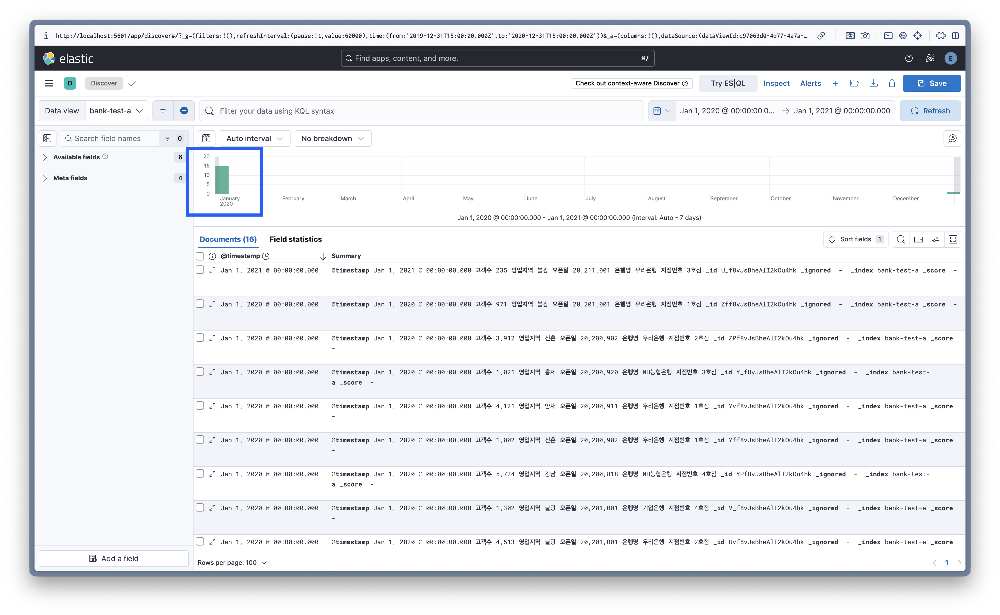
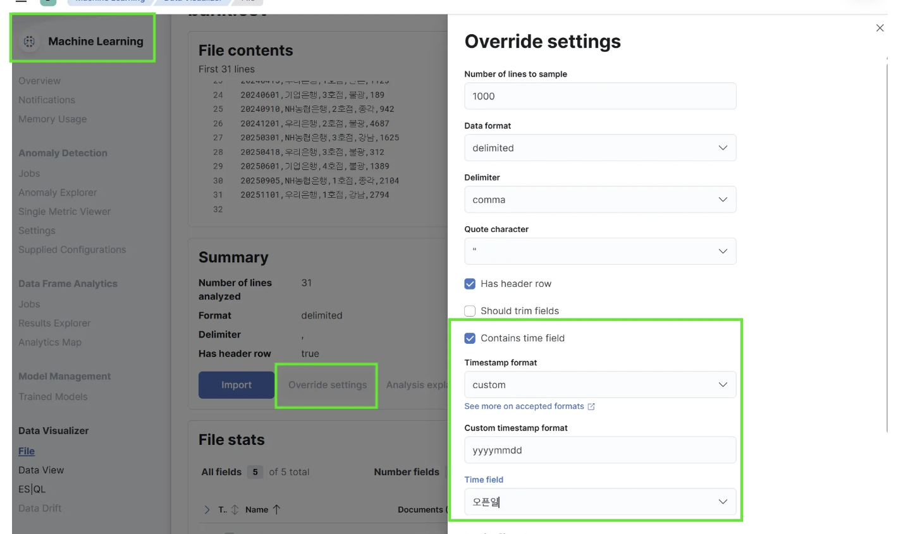
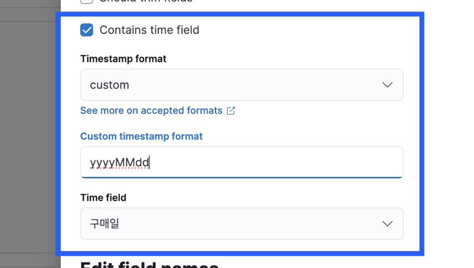
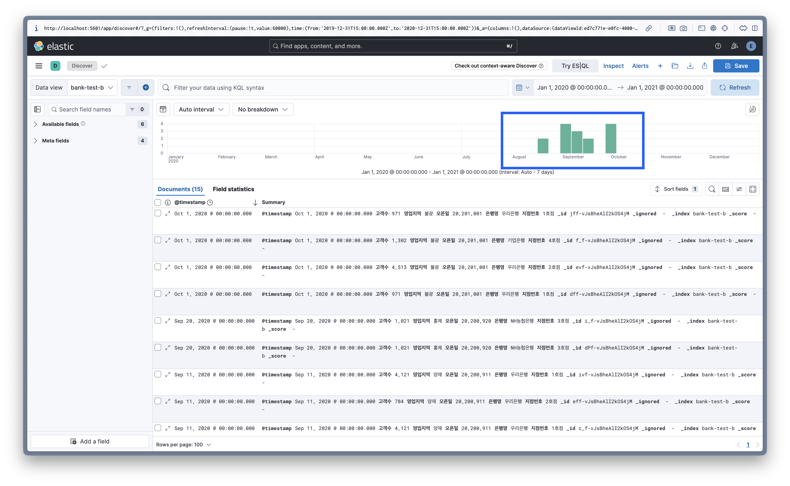

# 시계열 데이터 파싱 오류 해결

## 1. 문제 상황

* Kibana에서 데이터 로드 후 인덱스 패턴을 설정하고 시각화를 진행했으나, 모든 연도의 데이터가 실제 날짜와 상관없이 1월(January)로 고정되어 표기되는 현상 발생

* 시간축 정보가 소실되어 정상적인 데이터 사이클 파악이 불가능함

    

* 실제 예제 데이터를 확인해본 결과 8월, 9월, 10월 등 다양한 월의 데이터가 정상적으로 포함되어 있음을 확인

    ```Plain text
    오픈일,은행명,지점번호,영업지역,고객수
    20200818,NH농협은행,4호점,강남,5724
    20200902,우리은행,1호점,신촌,1002
    20200911,우리은행,1호점,양재,4121
    20200920,NH농협은행,3호점,홍제,1021
    20201001,우리은행,1호점,불광,971
    20200902,우리은행,2호점,신촌,3912
    20200911,우리은행,2호점,양재,784
    20201001,우리은행,2호점,불광,4513
    20200818,NH농협은행,4호점,강남,5724
    20200902,우리은행,1호점,신촌,1002
    20200911,우리은행,1호점,양재,4121
    20200920,NH농협은행,3호점,홍제,1021
    20200902,우리은행,2호점,신촌,3912
    20201001,우리은행,1호점,불광,971
    ```

* 데이터 자체의 오류가 아닌, Kibana 인덱싱 또는 날짜 필드 매핑 과정에서 날짜 포맷 해석 오류가 발생했음을 인지함

## 2. 문제 원인

* 날짜 포맷을 지정하는 과정에서 대소문자를 엄격히 구분하지 않고 `yyyymmdd` 형식을 사용함

    

* 많은 프로그래밍 언어와 데이터베이스에서 `mm`은 분 (Minute), `MM`은 월 (Month)를 의미함

* 잘못된 포맷팅으로 인해 월 (Month) 정보가 분 (Minute)으로 해석되어, 월 (Month)정보가 소실됨

## 3. 해결 방안

* 잘못 지정된 소문자 `mm` (분)을 대문자 `MM` (월)으로 교체하여 날짜 형식을 `yyyyMMdd`로 재설정함

    

## 4. 최종 확인

* 잘못된 포맷으로 적재되었던 기존 데이터를 완전히 삭제하고, 수정된 `yyyyMMdd` 포맷을 적용하여 데이터를 신규 적재함

* 모든 데이터가 1월로 수렴하던 현상이 사라지고 실제 원천 데이터의 발생 시점 (8~10월 등)에 맞춰 정확히 분포됨을 확인

    